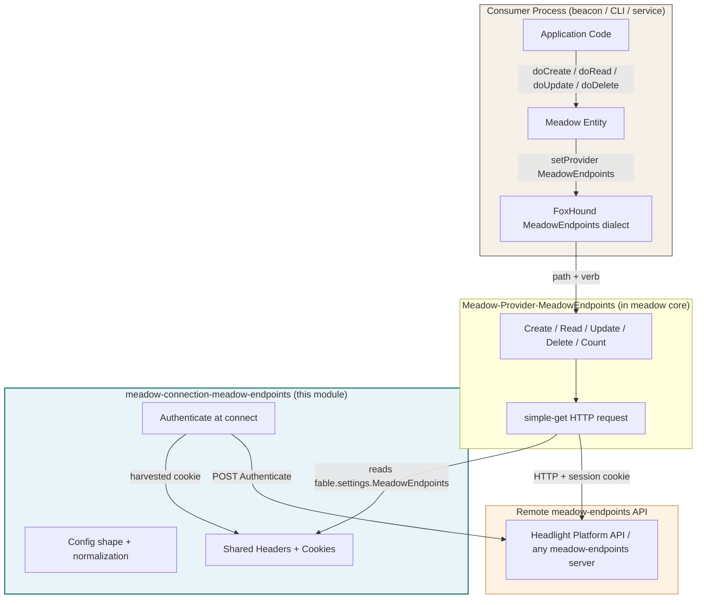
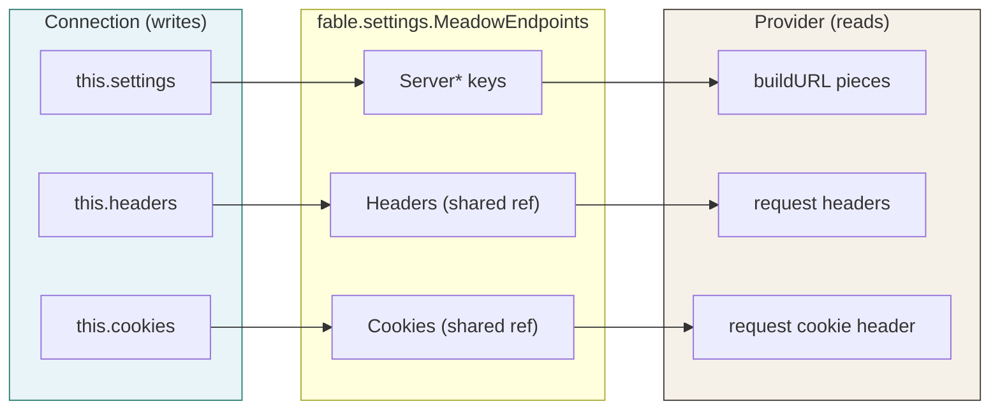
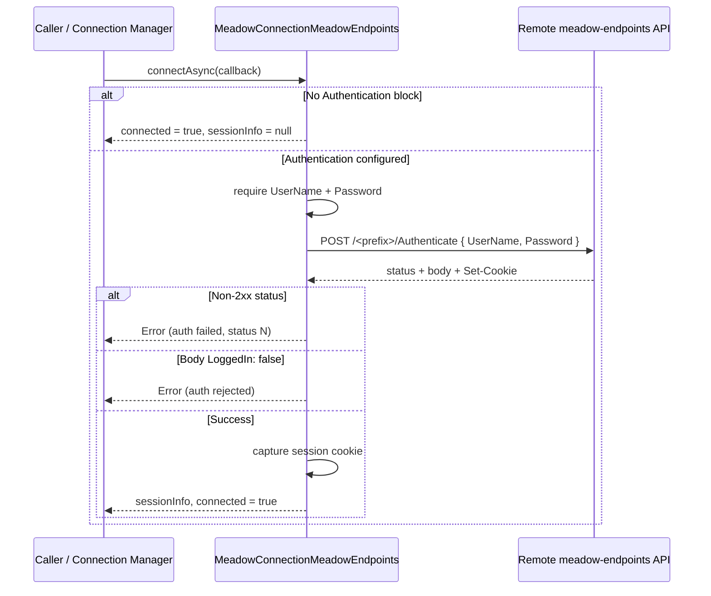
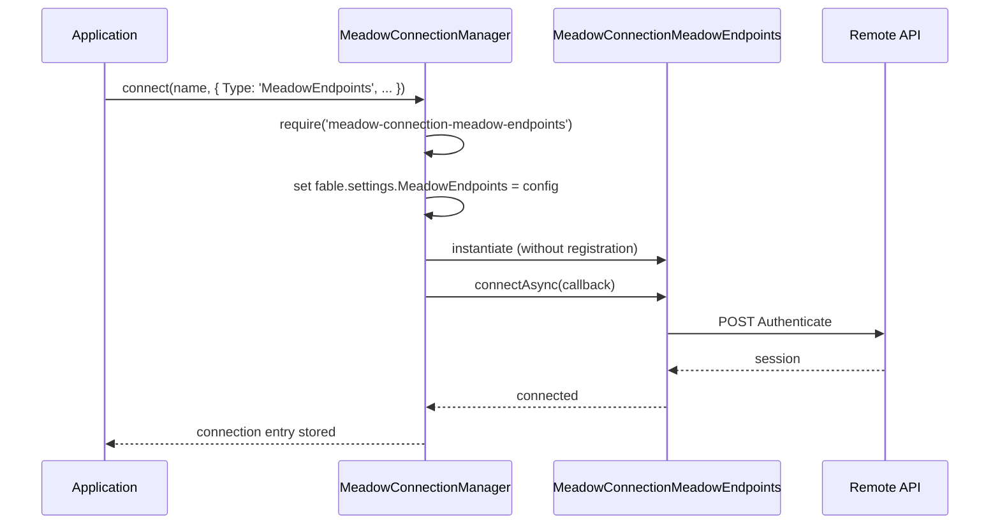

# Architecture

Meadow Connection Meadow Endpoints fronts a remote meadow-endpoints REST API as a local meadow data source. This page documents the relay design, the split of responsibilities between this module and the meadow core provider, the authentication flow, and how the connection loads through meadow-connection-manager.

---

## The Relay Split

The defining fact of this module: it does **not** make the meadow CRUD HTTP requests. That work lives in the meadow core provider `Meadow-Provider-MeadowEndpoints`. This module is the connection-manager-shaped wrapper that surrounds the provider with configuration, shared state, and authentication.

The two halves communicate through `fable.settings.MeadowEndpoints`. This module writes its resolved config there (sharing the `Headers` and `Cookies` objects **by reference**), and the provider reads from there when it builds each request. Because the cookie array is shared, a session cookie captured after connect is immediately visible to the provider on its next request.

---

## Component Responsibilities

### MeadowConnectionMeadowEndpoints (this module)

The connection class, extending `FableServiceProviderBase`:

- **Construction** -- resolves config from explicit options (`options.MeadowEndpoints` or the options object) layered over `fable.settings.MeadowEndpoints` layered over defaults; coerces `ServerPort` to a string; normalizes a trailing slash onto `ServerEndpointPrefix`; projects the result back onto `fable.settings.MeadowEndpoints`.
- **Authentication** -- `connectAsync()` POSTs (or GETs) the auth endpoint and harvests the session cookie. `connect()` is a sync shim that kicks off `connectAsync()` and returns immediately.
- **Shared state mutators** -- `addCookie()` and `setHeader()` mutate the shared cookie / header state the provider reads.
- **Lifecycle** -- `disconnect()` clears the cookie jar and session info so a re-connect starts clean.
- **Schema parity stubs** -- `listTables()`, `introspectDatabaseSchema()`, and `schemaProvider` exist for shape parity with SQL drivers; the upstream owns its own schema.

### Meadow-Provider-MeadowEndpoints (meadow core)

The request builder this connection feeds, living in the `meadow` package under `source/providers/`:

- Reads `fable.settings.MeadowEndpoints` for the server address pieces, `Headers`, and `Cookies`.
- Implements `Create`, `Read`, `Update`, `Delete`, and `Count` -- each sets the FoxHound `MeadowEndpoints` dialect, builds the request body/path from the query, attaches the joined cookies and headers, and sends it with `simple-get`.

### The Shared Settings Bag

---

## Authentication Flow

`connectAsync()` is the heart of the connect step. When an `Authentication` block is configured, it issues a single request to the auth endpoint and harvests the session cookie.

### Cookie Capture

The session cookie is captured by `_captureSessionCookie()` in two ways, in order:

1. **`Set-Cookie` header** -- scans the response `set-cookie` array for an entry beginning with `<CookieName>=` and appends the `name=value` pair to the shared cookie list.
2. **JSON body fallback** -- if the upstream omitted `Set-Cookie` but echoed a `SessionID` in the JSON body, the cookie is rebuilt as `<CookieName>=<SessionID>`. This lets stateless callers (and Headlight) recover the session even when `Set-Cookie` was not surfaced.

If neither yields a cookie, `connectAsync()` returns an error even though the HTTP status was a success.

---

## Loading Through the Connection Manager

`meadow-connection-manager` is the registry that maps a `Type` string to a connection module. The relevant entries for this module:

- **Module map:** `'MeadowEndpoints'` &rarr; `'meadow-connection-meadow-endpoints'`
- **Form schema path:** `'MeadowEndpoints'` &rarr; `'source/Meadow-Connection-MeadowEndpoints-FormSchema.js'`

When the manager runs `testConnection`, this type is treated as **already probed** -- the `Authenticate` call during connect is itself the connectivity check, so no extra round-trip probe is issued (unlike lazy-pool SQL drivers, which need a `SELECT 1`).

The manager also exposes the form schema without loading the driver: `getProviderFormSchema('MeadowEndpoints')` resolves and `require()`s the pure-data form schema file directly, so a UI can render the connection form even where `simple-get` / `meadow` are not installed.

---

## Schema Introspection

The upstream meadow owns its own schema, so this connection deliberately does not generate DDL or introspect:

| Member | Behavior |
|--------|----------|
| `schemaProvider` | Returns `null` |
| `listTables(cb)` | Calls back with an empty array `[]` |
| `introspectDatabaseSchema(cb)` | Calls back with an Error -- introspection is not supported |

These exist for connection-manager shape parity with the SQL drivers. Callers that need introspection should hit the upstream server's own documented routes.

---

## Comparison with Other Connectors

| Aspect | MeadowEndpoints | MySQL | RetoldDataBeacon |
|--------|-----------------|-------|------------------|
| Backend | Remote REST API | MySQL server | Remote beacon via Ultravisor |
| Transport | HTTP (`simple-get`) | mysql2 pool (TCP) | Ultravisor dispatch |
| Makes its own requests | No -- provider does | Yes (pool) | Provider dispatches |
| DDL generation | No (upstream owns schema) | Yes | No |
| Auth at connect | Yes (session cookie) | DB credentials | Handshake |
| `testConnection` probe | Skipped (connect = probe) | `SELECT 1` | Skipped (handshake = probe) |

The closest sibling in shape is [retold-databeacon's connection](https://fable-retold.github.io/meadow-connection-retold-databeacon/): both are relay wrappers whose paired meadow provider does the transport, and both skip the manager's connectivity probe because connecting is itself the check.
